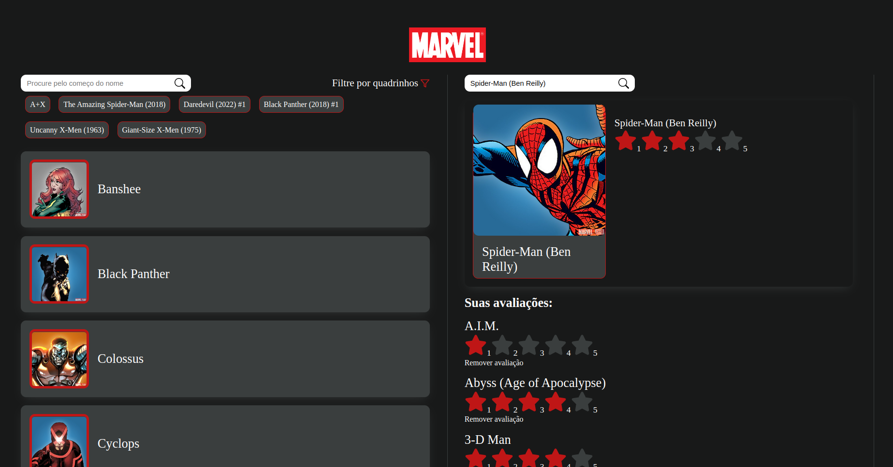

# Marvel App

Teste para a empresa Fpass utilizando a api da  Marvel Comics [Marvel comics](https://developer.marvel.com/)

Projeto online https://marvel-teste-will.netlify.app/



### 📋 INSTRUÇÕES PARA RODAR O PROJETO

```
git
node
npm
```

### 🔧 Instalação

No seu terminal dê o comando:

```
git clone 
```

E depois:

```
npm install
```

Antes de rodar a aplicação no servidor é preciso configurar as keys da api,e  para acessar essas keys é preciso criar uma conta na [Developer Marvel](https://developer.marvel.com) e acessá-las em https://developer.marvel.com/account

Após isso vá no arquivo 'constants.ts' e troque os valores das keys:

Para rodar a aplicação no servidor em modo de desenvolvimento:

```
npm run dev
```

Para fazer um build da aplicação:

```
npm run build
```

Por fim, para subir o build da aplicação no servidor:

```
npm run preview
```

## 💻 Início da aplicação

Na aplicação contém duas abas interativas, na primeira aba é renderizada uma lista de personagens da marvel, e nessa mesma aba é possível fazer um filtro pelos os nomes que começam os personagens e também pelos quadrinhos que participaram. Na segunda aba é possível buscar um personagem pelo o nome completo e atribuir a este personagem uma nota em estrelas em quantidade de 1 a 5, que na qual esta pontuação sempre irá se manter ao sair e entrar novamente no site.


## 🛠️ Construído com

- [React.js](https://reactjs.org/) - Biblioteca javascript
- [Typescript](https://www.typescriptlang.org/) - Linguagem de typagens
- [Styled-components](https://styled-components.com/) - Css in Javascript
- [React-icons](https://react-icons.github.io/react-icons/) - Biblioteca de ícones
- [React-router-dom](https://reactrouter.com/en/main) - Biblioteca de rotas
- [MD5](https://github.com/pvorb/node-md5) - Função JavaScript para hash

## 🎁 Expressões de gratidão

- Obrigado por ler até aqui 🤓.

---

⌨️ com ❤️ por Programação 😊
